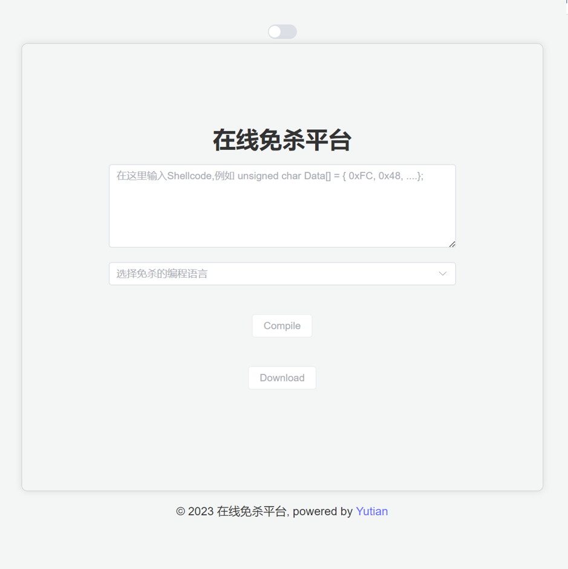

# BypassAVOnline-Front


#### 技术栈

- Vite3
- Vue3 
- Vuex
- Vue Router 
- Axios 
- element-plus 
- vueuse 
- js-cookie 
- normalize.css
- eslint + prettier

    ……

#### 主题预览

- [x] 日间模式


- [x] 黑夜模式


#### 常用指令

- 安装

```
yarn install
```

- 启动

```
yarn dev
```

- 编译

```
yarn build
```

- 检查和修复文件

```
yarn lint
```

- 格式化代码

```
yarn format
```

#### 更多自定义配置

See [Configuration Reference](https://cli.vuejs.org/config/).
