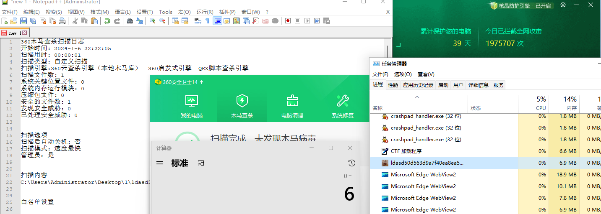
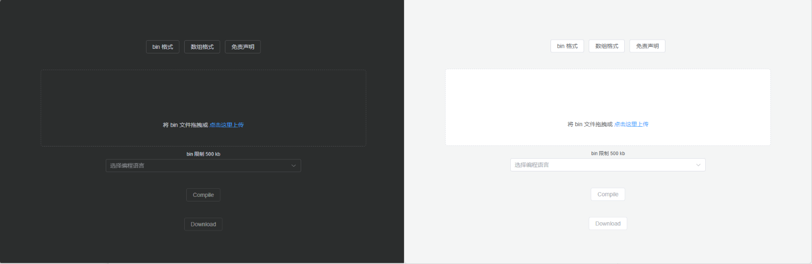

> 免责声明：本工具仅供安全研究和教学目的使用，用户须自行承担因使用该工具而引起的一切法律及相关责任。作者概不对任何法律责任承担责任，且保留随时中止、修改或终止本工具的权利。使用者应当遵循当地法律法规，并理解并同意本声明的所有内容。

# BypassAV-Online

不建议上传沙箱、VT 等

一个基于 Spring Boot 的在线免杀生成平台，还在初期，功能待完善。未来将增加更多编程语言的支持。

新版可过核晶



## 特点

- 在线生成
- 可多个人使用
- 随机变量名
- 随机图标
- 反沙箱

## 开发日志

[免杀-基于 Spring Boot 在线免杀平台开发记录 · yutian's blog](https://yutianqaq.github.io/2023/12/28/免杀-基于-Spring-Boot-在线免杀平台开发记录/)


## 首页


# 快速体验

## 初次安装

```
wget https://github.com/yutianqaq/BypassAV-Online/releases/download/v1.2/bypassAVOnline.zip

unzip bypassAVOnline.zip

cd bypassAVOnline

curl https://nim-lang.org/choosenim/init.sh -sSf | sh
# 输入 y
echo "PATH=/home/kali/.nimble/bin:$PATH" >> ~/.zshrc
source ~/.zshrc

# winim 依赖
nimble install winim

sudo apt install mingw-w64

java -jar bypass-0.0.1-SNAPSHOT.jar
```

## 前端配置

```
# 前端
sudo cp -r dist/assets dist/index.html dist/logo.ico /var/www/html/
sudo chown -R www-data:www-data /var/www/html
```

输入以下命令，开启模块

```
sudo a2enmod proxy
sudo a2enmod proxy_http
sudo a2enmod rewrite
```

编辑 `/etc/apache2/sites-available/000-default.conf` 增加以下配置

```
        ProxyPass /api http://localhost:8080
        ProxyPassReverse /api http://localhost:8080
        <Directory /var/www/html>
                Options Indexes FollowSymLinks
                AllowOverride All
                Require all granted
        </Directory>

```


重启 Apache 服务器

```
sudo systemctl restart apache2
```

至此完成后端，前端配置

## 非初次安装

从 https://github.com/yutianqaq/BypassAV-Online/releases/latest 下载最新发行版

```
unzip bypassAVOnline.zip
cd bypassAVOnline

java -jar bypass-0.0.1-SNAPSHOT.jar
sudo cp -r dist/assets dist/index.html dist/logo.ico /var/www/html/
sudo chown -R www-data:www-data /var/www/html
sudo systemctl restart apache2
```


# 从源码构建搭建文档

Spring Boot 后端、Vue 前端。

## 部署

### 后端

使用 idea 打开，点击 右侧 maven，点击 package


然后在 target 目录会生成一份 `bypass-0.0.1-SNAPSHOT.jar`。

输入下面的命令

```
cd /home/kali
mkdir bypassAVOnline
cd bypassAVOnline
mkdir template
mkdir download
```

新建一个名为 application.yaml 的文件，输入以下内容

```
bypassav:
  templatesDirectory: /home/kali/bypassAVOnline/template/
  templateCMapping:
    v1: v1.c
  templateNIMMapping:
    v1: v1.nim
    v2: x2Ldr-Plus.nim
  compilerC: x86_64-w64-mingw32-gcc
  compilerNIM: nim
  storageDirector: /home/kali/bypassAVOnline/download
spring:
  servlet:
    multipart:
      enabled: true
      max-file-size: 1MB
      max-request-size: 1MB
```

此时后端工作目录结构如下：

```
┌──(kali㉿kali)-[~/bypassAVOnline]
└─$ tree                                                                                
.
├── application.yaml
├── bypass-0.0.1-SNAPSHOT.jar
├── download
└── template
    ├── v1.c
    └── v1.nim

3 directories, 4 files

```


下载编译器

输入下面的命令

```
curl https://nim-lang.org/choosenim/init.sh -sSf | sh
# 输入 y
export PATH=/home/kali/.nimble/bin:$PATH

sudo apt install mingw-w64
```

此状态为安装成功。


启动后端，成功状态如下

```
curl -X POST -H "Content-Type: application/json" -d '{"code":"0x90", "templateName":"v1"}' http://localhost:8080/v1/compileC

wget http://localhost:8080/v1/download/c7af340b-8358-44a3-9985-82189468c36d.exe
```


## 前端页面部署

输入 `yarn build`，然后输入以下命令，复制到 Apache 目录

```
sudo cp -r dist/assets dist/index.html dist/logo.ico /var/www/html/
sudo chown -R www-data:www-data /var/www/html
```

输入以下命令，开启模块

```
sudo a2enmod proxy
sudo a2enmod proxy_http
sudo a2enmod rewrite
```

编辑 `/etc/apache2/sites-available/000-default.conf` 增加以下配置

```
        ProxyPass /api http://localhost:8080
        ProxyPassReverse /api http://localhost:8080
        <Directory /var/www/html>
                Options Indexes FollowSymLinks
                AllowOverride All
                Require all granted
        </Directory>

```


重启 Apache 服务器

```
sudo systemctl restart apache2
```

至此完成后端，前端配置


# TODO
- [x] 优化前端交互
- [ ] 增加更多模板
- [ ] 增加免杀性


# 参考

Vue 基础模板：https://github.com/wsheeny/vite-vue-template


