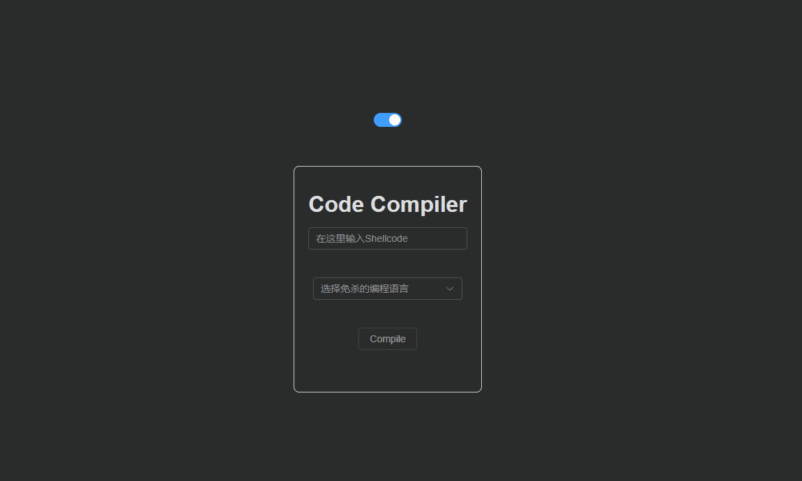
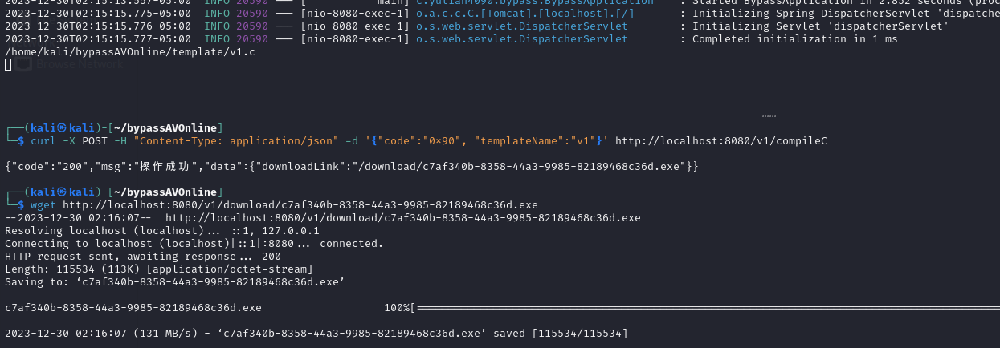
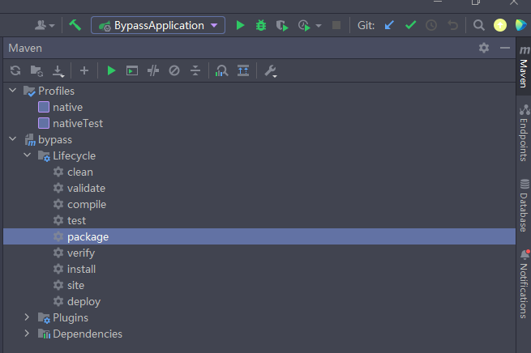
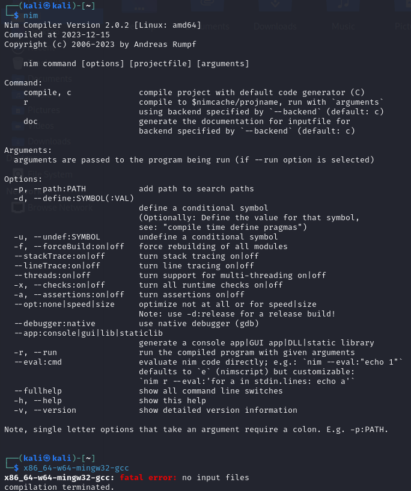
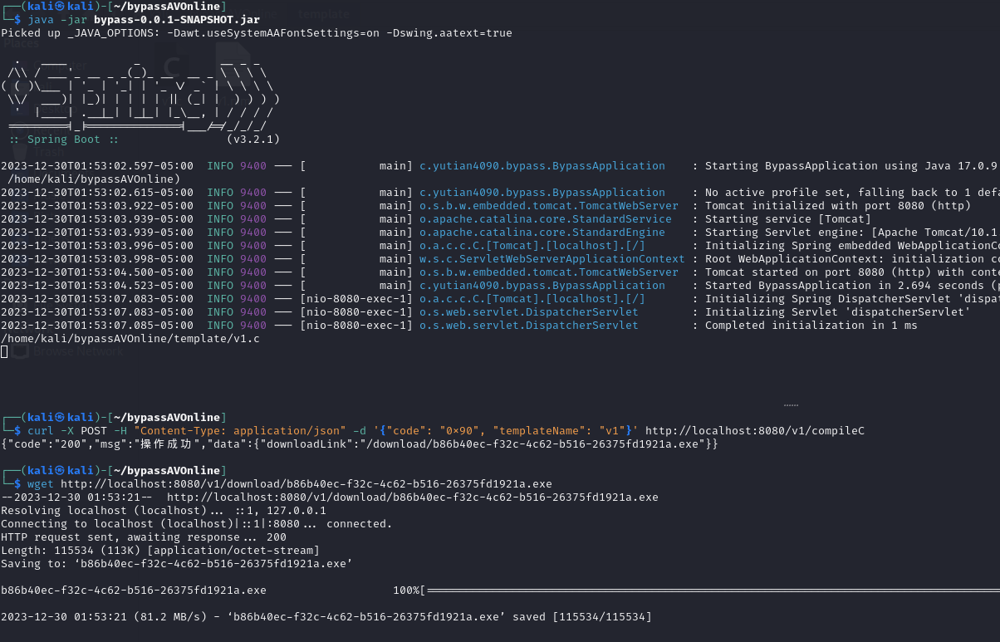

> 免责声明：本工具仅用于安全研究和教学目的，用户应自行承担因使用该工具而引起的一切法律和相关责任。作者不对任何法律责任承担责任。

# BypassAV-Online

一个基于 Spring Boot 的在线免杀生成平台，还在初期，功能待完善。


## 演示


# 快速体验

```
wget https://github.com/yutianqaq/BypassAV-Online/releases/download/%E5%88%9D%E5%A7%8B%E7%89%88%E6%9C%AC/bypassAVOnline.zip

unzip bypassAVOnline.zip

cd bypassAVOnline

curl https://nim-lang.org/choosenim/init.sh -sSf | sh
# 输入 y
export PATH=/home/kali/.nimble/bin:$PATH

sudo apt install mingw-w64

java -jar bypass-0.0.1-SNAPSHOT.jar
```

测试

```
curl -X POST -H "Content-Type: application/json" -d '{"code":"0x90", "templateName":"v1"}' http://localhost:8080/v1/compileC

{"code":"200","msg":"操作成功","data":{"downloadLink":"/download/c7af340b-8358-44a3-9985-82189468c36d.exe"}}                                                                                                                                                                                                                                            
┌──(kali㉿kali)-[~/bypassAVOnline]
└─$ wget http://localhost:8080/v1/download/c7af340b-8358-44a3-9985-82189468c36d.exe
--2023-12-30 02:16:07--  http://localhost:8080/v1/download/c7af340b-8358-44a3-9985-82189468c36d.exe
Resolving localhost (localhost)... ::1, 127.0.0.1
Connecting to localhost (localhost)|::1|:8080... connected.
HTTP request sent, awaiting response... 200 
Length: 115534 (113K) [application/octet-stream]
Saving to: ‘c7af340b-8358-44a3-9985-82189468c36d.exe’
```



# 搭建文档

springboot 后端、vue 前端。

## 部署

### 后端

使用 idea 打开，点击 右侧 maven，点击 package




然后在 target 目录会生成一份 `bypass-0.0.1-SNAPSHOT.jar`。

输入下面的命令

```
cd /home/kali
mkdir bypassAVOnline
cd bypassAVOnline
mkdir template
mkdir download
```

新建一个名为 application.yaml 的文件，输入以下内容

```
bypassav:
  templatesDirectory: /home/kali/bypassAVOnline/template/
  templateCMapping:
    v1: v1.c
  templateNIMMapping:
    v1: v1.nim
  compilerC: x86_64-w64-mingw32-gcc
  compilerNIM: nim
  storageDirector: /home/kali/bypassAVOnline/download

```

此时后端工作目录结构如下：

```
┌──(kali㉿kali)-[~/bypassAVOnline]
└─$ tree                                                                                
.
├── application.yaml
├── bypass-0.0.1-SNAPSHOT.jar
├── download
└── template
    ├── v1.c
    └── v1.nim

3 directories, 4 files

```


下载编译器

输入下面的命令

```
curl https://nim-lang.org/choosenim/init.sh -sSf | sh
# 输入 y
export PATH=/home/kali/.nimble/bin:$PATH

sudo apt install mingw-w64
```

此状态为安装成功。




启动后端，成功状态如下

```
curl -X POST -H "Content-Type: application/json" -d '{"code":"0x90", "templateName":"v1"}' http://localhost:8080/v1/compileC

wget http://localhost:8080/v1/download/c7af340b-8358-44a3-9985-82189468c36d.exe
```





# TODO
[] 优化前端交互
[] 增加更多模板
[] 增加免杀性

## 开发日志

[免杀-基于 Spring Boot 在线免杀平台开发记录 · yutian's blog](https://yutianqaq.github.io/2023/12/28/免杀-基于-Spring-Boot-在线免杀平台开发记录/)

