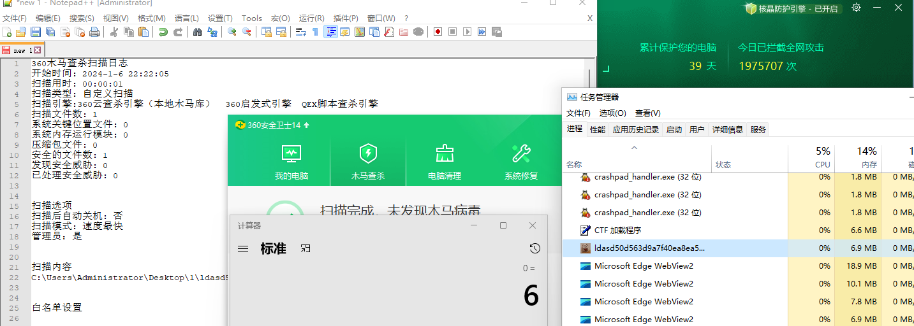
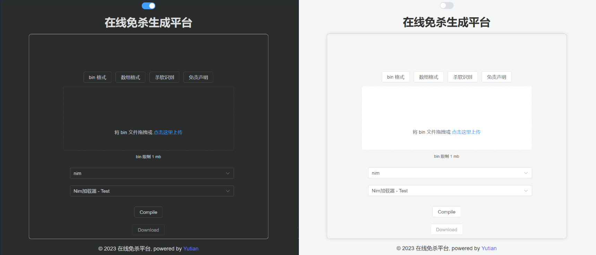

> 免责声明：本工具仅供安全研究和教学目的使用，用户须自行承担因使用该工具而引起的一切法律及相关责任。作者概不对任何法律责任承担责任，且保留随时中止、修改或终止本工具的权利。使用者应当遵循当地法律法规，并理解并同意本声明的所有内容。

# BypassAV-Online

~~🚧：优化代码，提高可读性，设计架构中...预计3周~~

新版已经开发完成，请移步https://github.com/yutianqaq/AVEvasionCraftOnline

**初期代码设计不足，难以维护与扩展，现已开发新版本**

留此仓库纪念初版

不建议上传沙箱、virustotal 等。

默认密码：yutian [搭建指南](https://github.com/yutianqaq/BypassAV-Online/wiki)

一个基于 Spring Boot 的在线免杀生成平台，还在初期，功能待完善。未来将增加更多编程语言的支持。

效果展示

## 特点

- 在线生成
- 可多个人使用
- 随机变量名
- 随机图标
- 反沙箱

## 首页

## 开发日志

[免杀-基于 Spring Boot 在线免杀平台开发记录 · yutian's blog](https://yutianqaq.github.io/2023/12/28/免杀-基于-Spring-Boot-在线免杀平台开发记录/)

# TODO
- [x] 优化前端交互
- [ ] 增加更多模板
- [ ] 增加免杀性

# 参考

Vue 基础模板：https://github.com/wsheeny/vite-vue-template

杀软识别：https://github.com/r00tSe7en/get_AV

